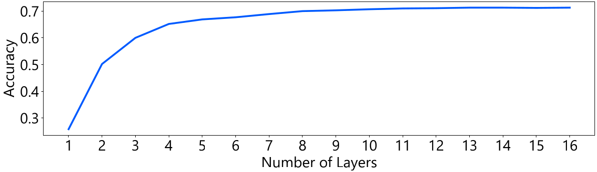
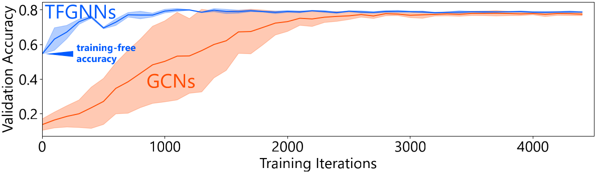
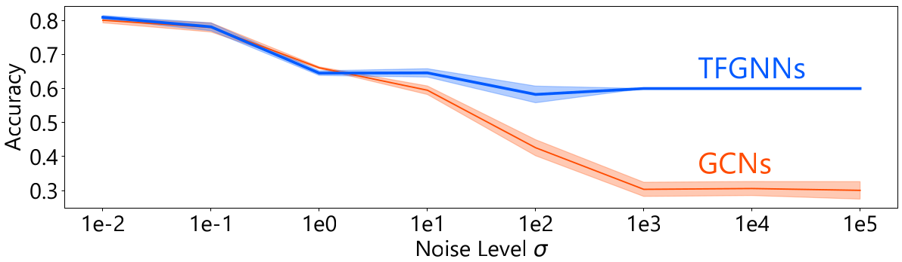

# Training-free Graph Neural Networks and the Power of Labels as Features (TMLR 2024)

[](https://arxiv.org/abs/2404.19288)

We propose training-free graph neural networks (TFGNNs), which can be used without training and can also be improved with optional training.

Paper: https://arxiv.org/abs/2404.19288

## 💿 Preparation

Install [Poetry](https://python-poetry.org/) and run the following command:

```bash
$ poetry install
```

## 🧪 Evaluation

### TFGNNs Outperform Existing GNNs in Training-free Setting

```bash
$ poetry run python trainingfree.py
```

| Model                               | Cora | CiteSeer | PubMed | CS   | Physics | Computers | Photo |
|-------------------------------------|------|----------|--------|------|---------|-----------|-------|
| GCNs                                | 0.163 | 0.167    | 0.180  | 0.079 | 0.101   | 0.023     | 0.119 |
| GCNs + LaF                          | 0.119 | 0.159    | 0.407  | 0.080 | 0.146   | 0.061     | 0.142 |
| GATs                                | 0.177 | 0.229    | 0.180  | 0.040 | 0.163   | 0.058     | 0.122 |
| GATs + LaF                          | 0.319 | 0.077    | 0.180  | 0.076 | 0.079   | 0.025     | 0.044 |
| TFGNNs + random initialization      | 0.149 | 0.177    | 0.180  | 0.023 | 0.166   | 0.158     | 0.090 |
| **TFGNNs (proposed)**               | **0.600** | **0.362**    | **0.413**  | **0.601** | **0.717**   | **0.730**     | **0.637** |


▲ **Results.** TFGNNs outperform existing GNNs in the training-free setting.

### Deep TFGNNs Perform Better in Training-free Setting

```bash
$ poetry run python numlayers.py
```



▲ **Results.** Deep TFGNNs perform better in the training-free setting.

### TFGNNs Converge Fast in Optional Training

```bash
$ poetry run python training.py
```



▲ **Results.** TFGNNs converge fast in optional training.

### TFGNNs are Robust to Feature Noise

```bash
$ poetry run python noisy.py
```



▲ **Results.** TFGNNs are robust to feature noise.


## 🖋️ Citation

```
@article{sato2024trainingfree,
  author    = {Ryoma Sato},
  title     = {Training-free Graph Neural Networks and the Power of Labels as Features},
  journal   = {Transactions on Machine Learning Research},
  year      = {2024},
}
```
